<!--LANG:roman-->

# System Design Case Scenarios

## 1. Design a URL Shortening Service (like Bitly)

**Asaan Urdu mein:**  
URL ko chhota karne ke liye auto‑increment ID ko Base62 me encode kiya jata hai. Ye short code primary key hota hai jo relational DB me store hota hai. Frequently accessed URLs ko Redis cache me rakha jata hai taake read‑heavy traffic handle ho sake. 301 redirects cache‑able hote hain, jabke analytics ke liye 302 use kiya jata hai. Data ko shard karne ke liye short code ke prefix ka istemal hota hai.

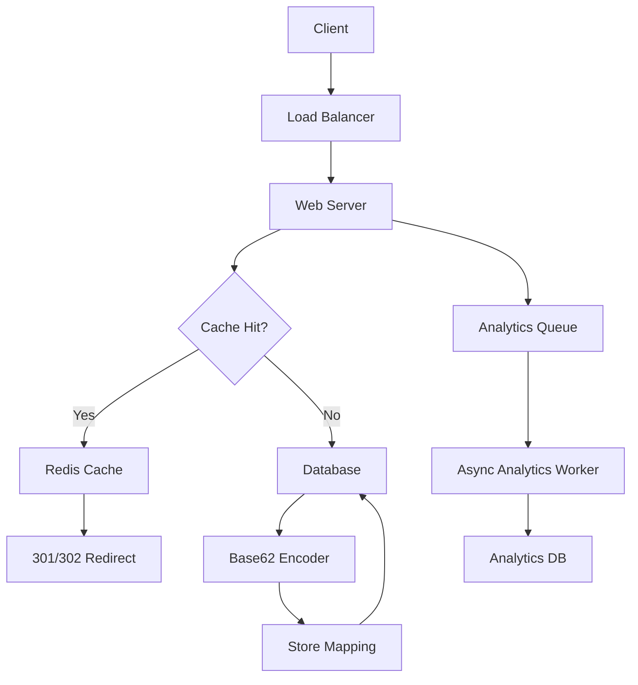
```mermaid
graph TD
    A[Client] --> B[Load Balancer]
    B --> C[Web Server]
    C --> D{Cache Hit?}
    D -->|Yes| E[Redis Cache]
    D -->|No| F[Database]
    F --> G[Base62 Encoder]
    E --> H[301/302 Redirect]
    G --> I[Store Mapping]
    I --> F
    C --> J[Analytics Queue]
    J --> K[Async Analytics Worker]
    K --> L[Analytics DB]
```

---

## 2. Design a Rate Limiter for a Public API

**Asaan Urdu mein:**  
Sliding window counter algorithm Redis sorted sets ya atomic counters ke saath implement kiya jata hai. Rate limit ko API gateway par enforce kiya jata hai taake backend servers kam load feel karein. Har API key ke liye primary limit aur IP ke liye fallback limit set hoti hai. Limit exceed hone par HTTP 429 response ke saath `Retry-After` header bheja jata hai. Distributed environment me Redis keys ko consistent hashing se distribute kiya jata hai.

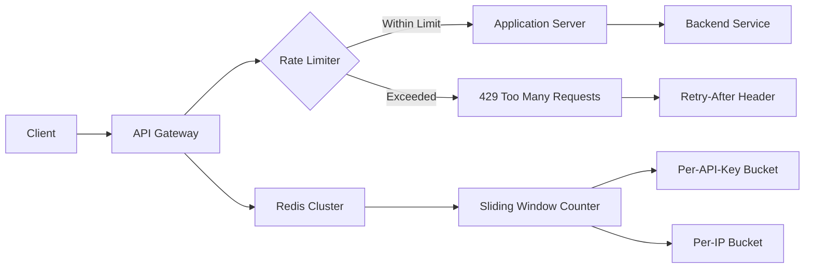
```mermaid
graph LR
    A[Client] --> B[API Gateway]
    B --> C{Rate Limiter}
    C -->|Within Limit| D[Application Server]
    C -->|Exceeded| E[429 Too Many Requests]
    B --> F[Redis Cluster]
    F --> G[Sliding Window Counter]
    G --> H[Per-API-Key Bucket]
    G --> I[Per-IP Bucket]
    D --> J[Backend Service]
    E --> K[Retry-After Header]
```

---

## 3. Design a Chat Application (like WhatsApp or Slack)

**Asaan Urdu mein:**  
Real‑time messaging ke liye WebSockets use kiye jate hain, fallback ke liye Socket.io. Messages ko time‑series DB (Cassandra/DynamoDB) me conversation ID aur timestamp ke hisaab se store kiya jata hai. Horizontal scaling ke liye Redis pub/sub se cross‑server broadcasting hota hai. Online presence Redis bitmaps aur heartbeats se track hoti hai. Group chats me fan‑out on write strategy aur offline users ke liye push notifications (APNS/FCM) use hoti hain.

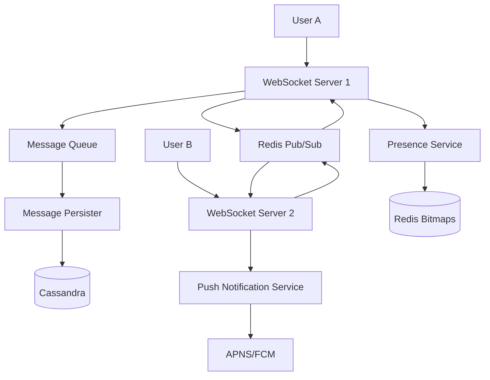
```mermaid
graph TD
    A[User A] --> B[WebSocket Server 1]
    C[User B] --> D[WebSocket Server 2]
    B --> E[Redis Pub/Sub]
    D --> E
    B --> F[Message Queue]
    F --> G[Message Persister]
    G --> H[(Cassandra)]
    B --> I[Presence Service]
    I --> J[(Redis Bitmaps)]
    D --> K[Push Notification Service]
    K --> L[APNS/FCM]
    E --> D
    E --> B
```

---

## 4. Design a News Feed System (like Facebook or Twitter/X)

**Asaan Urdu mein:**  
Regular users ke liye write‑time fan‑out hota hai, jahan post ko har follower ke Redis feed list me push kiya jata hai. Celebrities jinke followers millions me hain, unke liye read‑time fan‑out use hota hai, timeline ko merge karke ranking ki jati hai. Ranking engagement score (likes, comments, recency) par based hoti hai, sirf chronological nahi. Cursor‑based pagination composite cursor (timestamp + post ID) se infinite scroll enable hota hai.

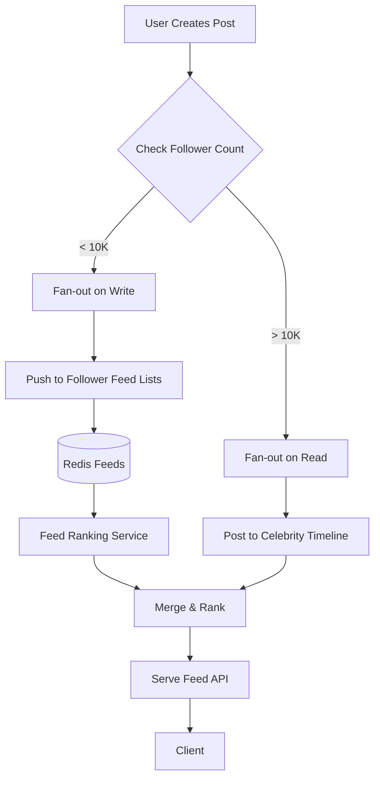
```mermaid
graph TD
    A[User Creates Post] --> B{Check Follower Count}
    B -->|< 10K| C[Fan-out on Write]
    B -->|> 10K| D[Fan-out on Read]
    C --> E[Push to Follower Feed Lists]
    E --> F[(Redis Feeds)]
    D --> G[Post to Celebrity Timeline]
    F --> H[Feed Ranking Service]
    H --> I[Merge & Rank]
    I --> J[Serve Feed API]
    J --> K[Client]
    G --> I
```

---

## 5. Design a Notification System (email, SMS, push)

**Asaan Urdu mein:**  
Notification generation ko Kafka queue se decouple kiya jata hai, alag topics email, SMS, push ke liye. Template service content render karti hai. Provider failures ke liye exponential backoff retry queue aur dead‑letter queue hoti hai. Har user/channel per rate‑limit lagayi jati hai taake spam na ho. Transactional notifications batch ki jati hain, promotional ko deduplicate kiya jata hai. Delivery status aur read receipts ko track kiya jata hai.

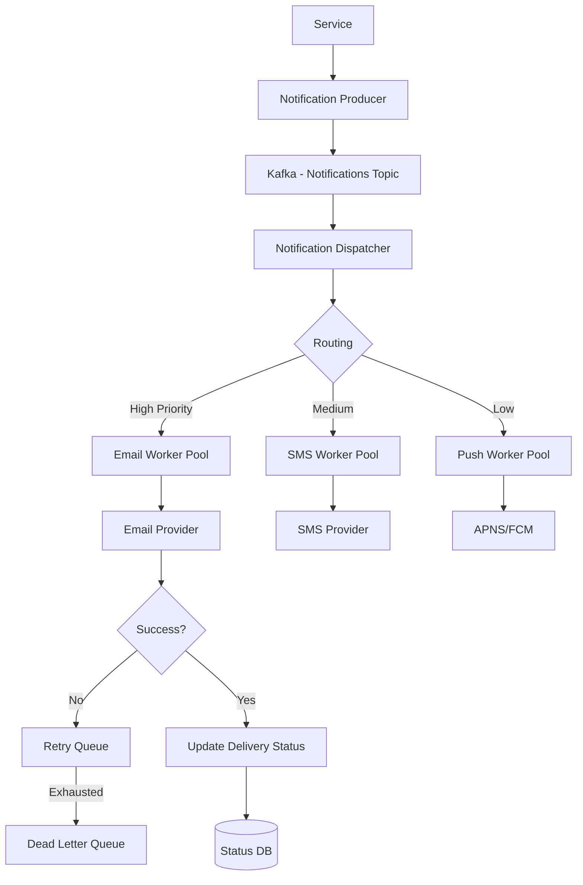
```mermaid
graph TD
    A[Service] --> B[Notification Producer]
    B --> C[Kafka - Notifications Topic]
    C --> D[Notification Dispatcher]
    D --> E{Routing}
    E -->|High Priority| F[Email Worker Pool]
    E -->|Medium| G[SMS Worker Pool]
    E -->|Low| H[Push Worker Pool]
    F --> I[Email Provider]
    G --> J[SMS Provider]
    H --> K[APNS/FCM]
    I --> L{Success?}
    L -->|No| M[Retry Queue]
    M -->|Exhausted| N[Dead Letter Queue]
    L -->|Yes| O[Update Delivery Status]
    O --> P[(Status DB)]
```

---

## 6. Design an E‑commerce Checkout & Inventory System

**Asaan Urdu mein:**  
Checkout ke dauran inventory rows par `SELECT FOR UPDATE` se pessimistic lock lagaya jata hai, overselling se bacha jata hai. Cart me 15‑minute TTL ke saath temporary reservation hoti hai. Flash sales me Redis Redlock se distributed lock use hota hai. Payments idempotent keys ke saath process ki jati hain. Saga pattern se transaction flow: reserve → payment → confirm, aur failure par compensating actions chalti hain.

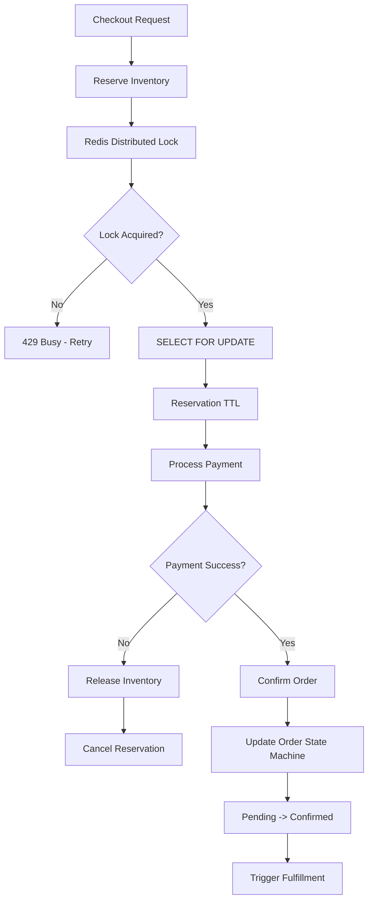
```mermaid
graph TD
    A[Checkout Request] --> B[Reserve Inventory]
    B --> C[Redis Distributed Lock]
    C --> D{Lock Acquired?}
    D -->|No| E[429 Busy - Retry]
    D -->|Yes| F[SELECT FOR UPDATE]
    F --> G[Reservation TTL]
    G --> H[Process Payment]
    H --> I{Payment Success?}
    I -->|Yes| J[Confirm Order]
    I -->|No| K[Release Inventory]
    K --> L[Cancel Reservation]
    J --> M[Update Order State Machine]
    M --> N[Pending -> Confirmed]
    N --> O[Trigger Fulfillment]
```

---

## 7. Design a File Storage and Sharing Service (like Google Drive/Dropbox)

**Asaan Urdu mein:**  
Files ko 4 MB chunks me split karke parallel resumable upload ki jati hai. Metadata relational DB me store hoti hai, chunks S3 me content‑addressed hash se deduplicate hoti hain. Edit ke liye binary diff (bsdiff) se differential sync hoti hai. Versioning copy‑on‑write se hoti hai aur version tree maintain hota hai. Sharing permissions access control tables me define hoti hain, sync service devices ko push notifications bhejti hai.

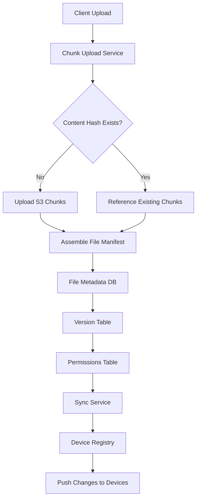
```mermaid
graph TD
    A[Client Upload] --> B[Chunk Upload Service]
    B --> C{Content Hash Exists?}
    C -->|No| D[Upload S3 Chunks]
    C -->|Yes| E[Reference Existing Chunks]
    D --> F[Assemble File Manifest]
    E --> F
    F --> G[File Metadata DB]
    G --> H[Version Table]
    H --> I[Permissions Table]
    I --> J[Sync Service]
    J --> K[Device Registry]
    K --> L[Push Changes to Devices]
```

---

## 8. Design a Ride‑Sharing System (like Uber/Careem)

**Asaan Urdu mein:**  
Geohashing + quad‑tree se driver‑rider matching efficient hoti hai. Rider location broadcast hoti hai, system nearby drivers ko geohash prefix se query karta hai aur distance ke hisaab se sort karta hai. Real‑time driver position Redis sorted set me timestamp ke saath store hoti hai. Surge pricing supply‑demand ratio ke basis par region wise calculate hoti hai. Trip lifecycle state machine: requested → accepted → arrived → in‑progress → completed.

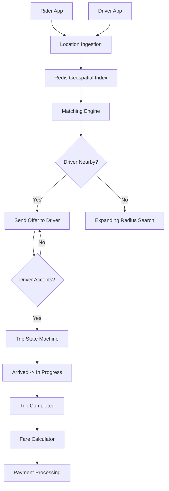
```mermaid
graph TD
    A[Rider App] --> B[Location Ingestion]
    C[Driver App] --> B
    B --> D[Redis Geospatial Index]
    D --> E[Matching Engine]
    E --> F{Driver Nearby?}
    F -->|Yes| G[Send Offer to Driver]
    F -->|No| H[Expanding Radius Search]
    G --> I{Driver Accepts?}
    I -->|Yes| J[Trip State Machine]
    I -->|No| G
    J --> K[Arrived -> In Progress]
    K --> L[Trip Completed]
    L --> M[Fare Calculator]
    M --> N[Payment Processing]
```

---

## 9. Design a Video Streaming Service (like YouTube/Netflix)

**Asaan Urdu mein:**  
Video upload ke baad staging bucket me store hoti hai, FFmpeg pipeline se multiple resolutions (360p‑4K) generate hoti hain aur HLS adaptive bitrate ke liye segment ki jati hain. CDN (CloudFront/Akamai) se low‑latency global delivery hoti hai. Metadata PostgreSQL me store hoti hai, recommendation service collaborative filtering use karti hai. View count asynchronous message queue se update hoti hai, playback ko affect nahi karti.

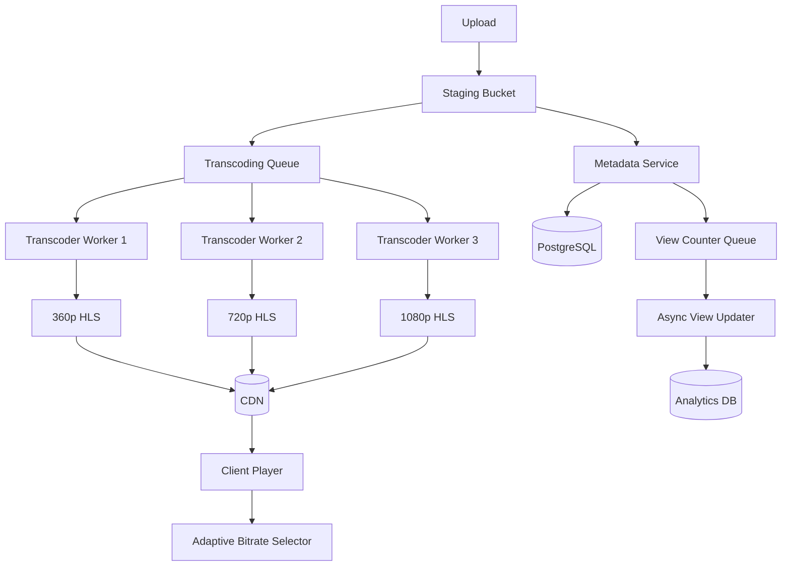
```mermaid
graph TD
    A[Upload] --> B[Staging Bucket]
    B --> C[Transcoding Queue]
    C --> D[Transcoder Worker 1] --> D1[360p HLS]
    C --> E[Transcoder Worker 2] --> E1[720p HLS]
    C --> F[Transcoder Worker 3] --> F1[1080p HLS]
    D1 --> G[(CDN)]
    E1 --> G
    F1 --> G
    G --> H[Client Player]
    H --> I[Adaptive Bitrate Selector]
    B --> J[Metadata Service]
    J --> K[(PostgreSQL)]
    J --> L[View Counter Queue]
    L --> M[Async View Updater]
    M --> N[(Analytics DB)]
```

---

## 10. Design a Web Crawler / Search Engine Indexer

**Asaan Urdu mein:**  
URL frontier ko distributed message queue me priority tiers ke saath maintain kiya jata hai. Duplicate URLs ko avoid karne ke liye Redis Bloom filter use hota hai. `robots.txt` aur per‑domain delay se crawl politeness enforce hoti hai. JavaScript pages ke liye headless Chrome (Puppeteer) use hota hai. Crawled content HDFS/S3 me store hoti hai, MapReduce se inverted index banaya jata hai. Sharding term hash ke basis par hoti hai.

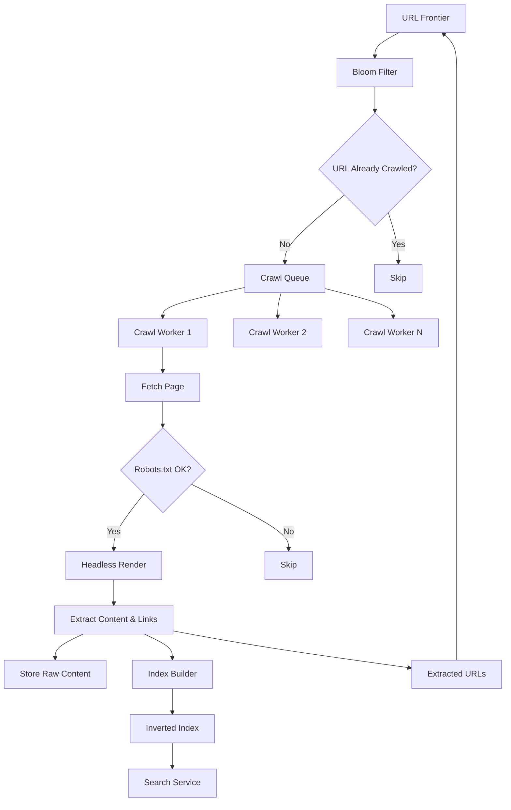
```mermaid
graph TD
    A[URL Frontier] --> B[Bloom Filter]
    B --> C{URL Already Crawled?}
    C -->|No| D[Crawl Queue]
    C -->|Yes| E[Skip]
    D --> F[Crawl Worker 1]
    D --> G[Crawl Worker 2]
    D --> H[Crawl Worker N]
    F --> I[Fetch Page]
    I --> J{Robots.txt OK?}
    J -->|Yes| K[Headless Render]
    J -->|No| L[Skip]
    K --> M[Extract Content & Links]
    M --> N[Store Raw Content]
    M --> O[Index Builder]
    O --> P[Inverted Index]
    P --> Q[Search Service]
    M --> R[Extracted URLs]
    R --> A
```

---

## 11. Design a Distributed Cache (like Redis at scale)

**Asaan Urdu mein:**  
Consistent hashing with virtual nodes keys ko cluster me evenly distribute karta hai aur node add/remove par minimal reshuffle hota hai. Cache‑aside pattern most use cases ke liye hota hai. Cache stampede ko mutex lock se handle kiya jata hai, sirf ek thread cache miss fill karta hai. High availability ke liye Redis Sentinel ya Redis Cluster use hota hai. Eviction LRU ya TTL based hoti hai. Write‑heavy workloads ke liye write‑back caching with async persistence use hoti hai.

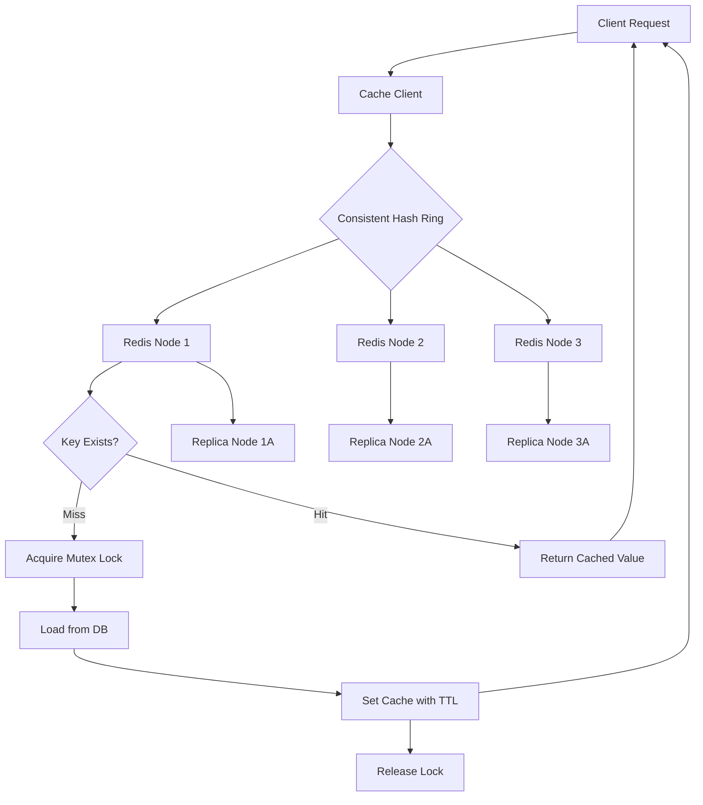
```mermaid
graph TD
    A[Client Request] --> B[Cache Client]
    B --> C{Consistent Hash Ring}
    C --> D[Redis Node 1]
    C --> E[Redis Node 2]
    C --> F[Redis Node 3]
    D --> G{Key Exists?}
    G -->|Miss| H[Acquire Mutex Lock]
    H --> I[Load from DB]
    I --> J[Set Cache with TTL]
    J --> K[Release Lock]
    G -->|Hit| L[Return Cached Value]
    L --> A
    J --> A
    D --> M[Replica Node 1A]
    E --> N[Replica Node 2A]
    F --> O[Replica Node 3A]
```

---

## 12. Design a Payment Processing System

**Asaan Urdu mein:**  
Har payment request ke saath idempotency key (UUID) attach ki jati hai, taake retry par duplicate charge na ho. Distributed transaction ke liye saga pattern use hota hai: reserve → capture → settle. Internal ledger table reconciliation ke liye payment gateway reports ke against compare ki jati hai. PCI compliance ke liye tokenization (Stripe/Braintree) use hoti hai, card data kabhi internal system me store nahi hota. Fraud detection rule‑based scoring aur ML models se hoti hai.

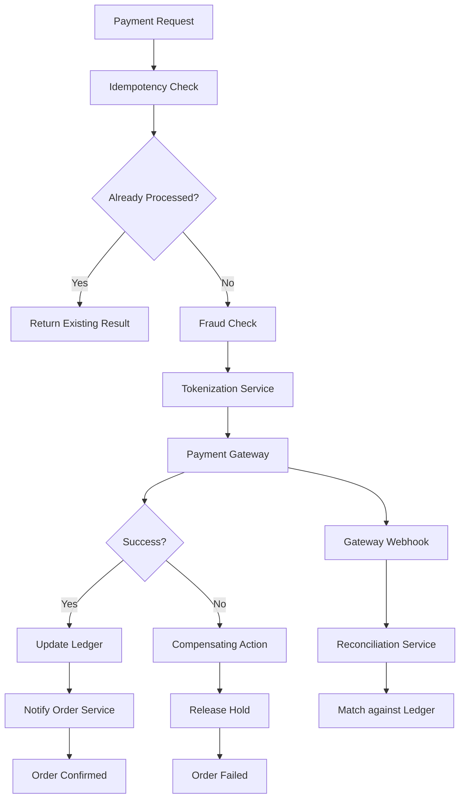
```mermaid
graph TD
    A[Payment Request] --> B[Idempotency Check]
    B --> C{Already Processed?}
    C -->|Yes| D[Return Existing Result]
    C -->|No| E[Fraud Check]
    E --> F[Tokenization Service]
    F --> G[Payment Gateway]
    G --> H{Success?}
    H -->|Yes| I[Update Ledger]
    H -->|No| J[Compensating Action]
    I --> K[Notify Order Service]
    J --> L[Release Hold]
    K --> M[Order Confirmed]
    L --> N[Order Failed]
    G --> O[Gateway Webhook]
    O --> P[Reconciliation Service]
    P --> Q[Match against Ledger]
```

---

## 13. Design a Job Scheduler / Task Queue System

**Asaan Urdu mein:**  
Jobs ko relational DB me status aur scheduled time ke saath store kiya jata hai. Leader‑election (ZooKeeper ya PostgreSQL advisory lock) se sirf ek scheduler due jobs pick karta hai. Due jobs Redis list ya RabbitMQ queue me push hoti hain workers ke liye. Failures ke liye retry count track hota hai aur dead‑letter queue me move ki jati hain. Priority queues time‑sensitive jobs ke liye use hoti hain. Cron‑like scheduling ke liye minute‑level polling hoti hai.

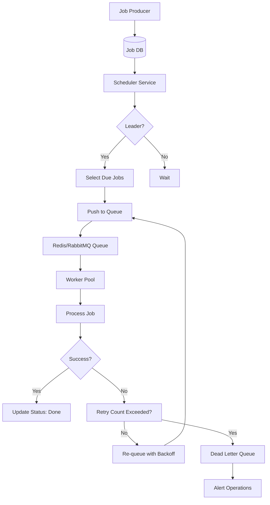
```mermaid
graph TD
    A[Job Producer] --> B[(Job DB)]
    B --> C[Scheduler Service]
    C --> D{Leader?}
    D -->|Yes| E[Select Due Jobs]
    D -->|No| F[Wait]
    E --> G[Push to Queue]
    G --> H[Redis/RabbitMQ Queue]
    H --> I[Worker Pool]
    I --> J[Process Job]
    J --> K{Success?}
    K -->|Yes| L[Update Status: Done]
    K -->|No| M[Retry Count Exceeded?]
    M -->|No| N[Re-queue with Backoff]
    M -->|Yes| O[Dead Letter Queue]
    N --> G
    O --> P[Alert Operations]
```

---

## 14. Design an Autocomplete / Typeahead Search Feature

**Asaan Urdu mein:**  
Search queries se compressed trie (prefix tree) banaya jata hai, har node par frequency count hoti hai. Service prefix ko trie me match karke top K completions frequency ke hisaab se return karti hai. Common 10,000 prefixes ke top‑10 results Redis me cache kiye jate hain sub‑millisecond latency ke liye. Trie daily logs se update hota hai. Typos ke liye Levenshtein automata ya BK‑tree use hota hai, edit distance 1‑2 tak handle hota hai.

```mermaid
graph TD
    A[User Input: "ap"] --> B[API Gateway]
    B --> C{In Prefix Cache?}
    C -->|Yes| D[Return Cached Results]
    C -->|No| E[Trie Lookup]
    E --> F[Traverse Trie]
    F --> G[Collect Top K Nodes]
    G --> H[Rank by Frequency]
    H --> I[Cache Result in Redis]
    I --> J[Return Suggestions]
    J --> K[Client Renders Dropdown]
    E --> L[Fuzzy Matcher]
    L --> M[Levenshtein Automaton]
    M --> G
```

---

## 15. Design a Booking System (like hotel or movie ticket booking)

**Asaan Urdu mein:**  
Seat/room records par `SELECT FOR UPDATE` se pessimistic lock lagaya jata hai, double‑booking se bacha jata hai. Checkout ke dauran 15‑minute TTL ke saath Redis me temporary hold rakhi jati hai, payment success par confirm hoti hai. Inventory browsing ke liye optimistic concurrency use hoti hai, purchase flow me pessimistic. High‑demand events ke liye virtual waiting room queue based entry system lagaya jata hai.

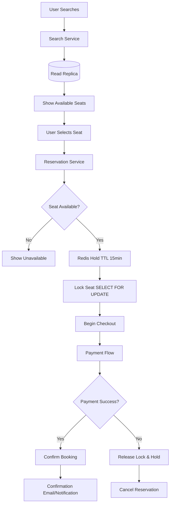
```mermaid
graph TD
    A[User Searches] --> B[Search Service]
    B --> C[(Read Replica)]
    C --> D[Show Available Seats]
    D --> E[User Selects Seat]
    E --> F[Reservation Service]
    F --> G{Seat Available?}
    G -->|No| H[Show Unavailable]
    G -->|Yes| I[Redis Hold TTL 15min]
    I --> J[Lock Seat SELECT FOR UPDATE]
    J --> K[Begin Checkout]
    K --> L[Payment Flow]
    L --> M{Payment Success?}
    M -->|Yes| N[Confirm Booking]
    M -->|No| O[Release Lock & Hold]
    O --> P[Cancel Reservation]
    N --> Q[Confirmation Email/Notification]
```

---

## 16. Design a Distributed Logging/Monitoring System

**Asaan Urdu mein:**  
Har service ke sidecar (Fluentd/Filebeat) se logs collect kar ke Kafka queue me bheje jate hain, ingestion spikes handle hoti hain. Stream processor logs ko parse, index (Elasticsearch) aur store karta hai. Kibana dashboards visualization ke liye use hoti hain. HTTP headers me trace IDs propagate kar ke microservices ke logs correlate kiye jate hain. Metrics ke liye Prometheus, alerts ke liye Alertmanager, PagerDuty/Slack notifications. Retention policy ke liye old logs S3 cold storage me archive hoti hain.

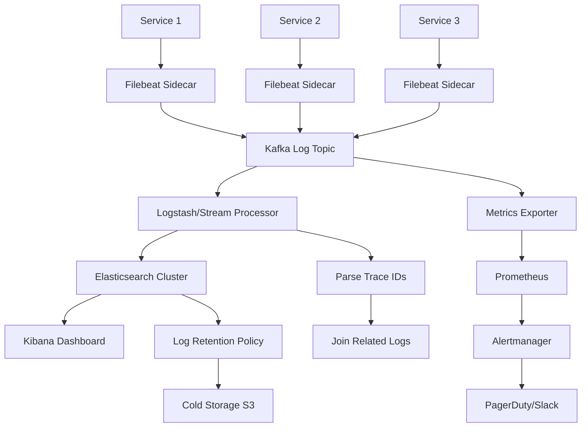
```mermaid
graph TD
    A[Service 1] --> B[Filebeat Sidecar]
    C[Service 2] --> D[Filebeat Sidecar]
    E[Service 3] --> F[Filebeat Sidecar]
    B --> G[Kafka Log Topic]
    D --> G
    F --> G
    G --> H[Logstash/Stream Processor]
    H --> I[Elasticsearch Cluster]
    I --> J[Kibana Dashboard]
    H --> K[Parse Trace IDs]
    K --> L[Join Related Logs]
    G --> M[Metrics Exporter]
    M --> N[Prometheus]
    N --> O[Alertmanager]
    O --> P[PagerDuty/Slack]
    I --> Q[Log Retention Policy]
    Q --> R[Cold Storage S3]
```

---

## 17. Design an Online Voting/Polling System

**Asaan Urdu mein:**  
Har eligible voter ko unique token issue kiya jata hai, vote time token validate hota hai. `(poll_id, user_token)` par unique constraint duplicate voting rokti hai. Live results ke liye Redis atomic `INCR` per option, WebSocket se clients ko push kiya jata hai. Write ke liye optimistic lock, read ke liye eventual consistency. Audit log har vote ko Merkle tree me hash karta hai, integrity verify hoti hai.

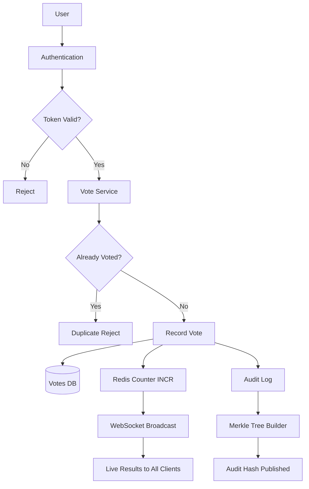
```mermaid
graph TD
    A[User] --> B[Authentication]
    B --> C{Token Valid?}
    C -->|No| D[Reject]
    C -->|Yes| E[Vote Service]
    E --> F{Already Voted?}
    F -->|Yes| G[Duplicate Reject]
    F -->|No| H[Record Vote]
    H --> I[(Votes DB)]
    H --> J[Redis Counter INCR]
    J --> K[WebSocket Broadcast]
    K --> L[Live Results to All Clients]
    H --> M[Audit Log]
    M --> N[Merkle Tree Builder]
    N --> O[Audit Hash Published]
```

---

## 18. Design a Multi‑Tenant SaaS Application Architecture

**Asaan Urdu mein:**  
Chhote tenants ke liye shared DB me `tenant_id` column hota hai, bade enterprises ke liye alag DB isolation. Middleware request domain ya JWT claim se tenant ID extract karta hai aur har query me inject karta hai. PostgreSQL row‑level security automatic tenant filtering karta hai. Usage per tenant counter service billing ke liye hoti hai. Tenant‑specific config JSON column ya config service me store hoti hai.

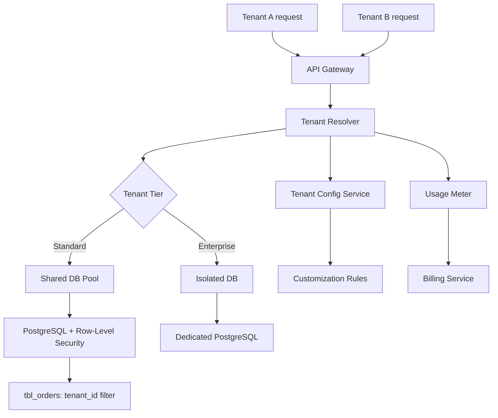
```mermaid
graph TD
    A[Tenant A request] --> B[API Gateway]
    C[Tenant B request] --> B
    B --> D[Tenant Resolver]
    D --> E{Tenant Tier}
    E -->|Standard| F[Shared DB Pool]
    E -->|Enterprise| G[Isolated DB]
    F --> H[PostgreSQL + Row-Level Security]
    H --> I[tbl_orders: tenant_id filter]
    G --> J[Dedicated PostgreSQL]
    D --> K[Tenant Config Service]
    K --> L[Customization Rules]
    D --> M[Usage Meter]
    M --> N[Billing Service]
```

---

## 19. Design a Real‑Time Collaborative Document Editor (like Google Docs)

**Asaan Urdu mein:**  
Conflict resolution ke liye Operational Transformation (OT) ya CRDTs use hote hain. OT operations (insert/delete) concurrent ops ke against transform hoti hain, sab clients same final state paate hain. Central server version vectors maintain karta hai. WebSockets real‑time sync ke liye. Offline edits local queue me store hoti hain, reconnect par sync hoti hain. Document checkpoints aur operation logs persist kiye jate hain. Cursor positions aur presence broadcast hoti hain.

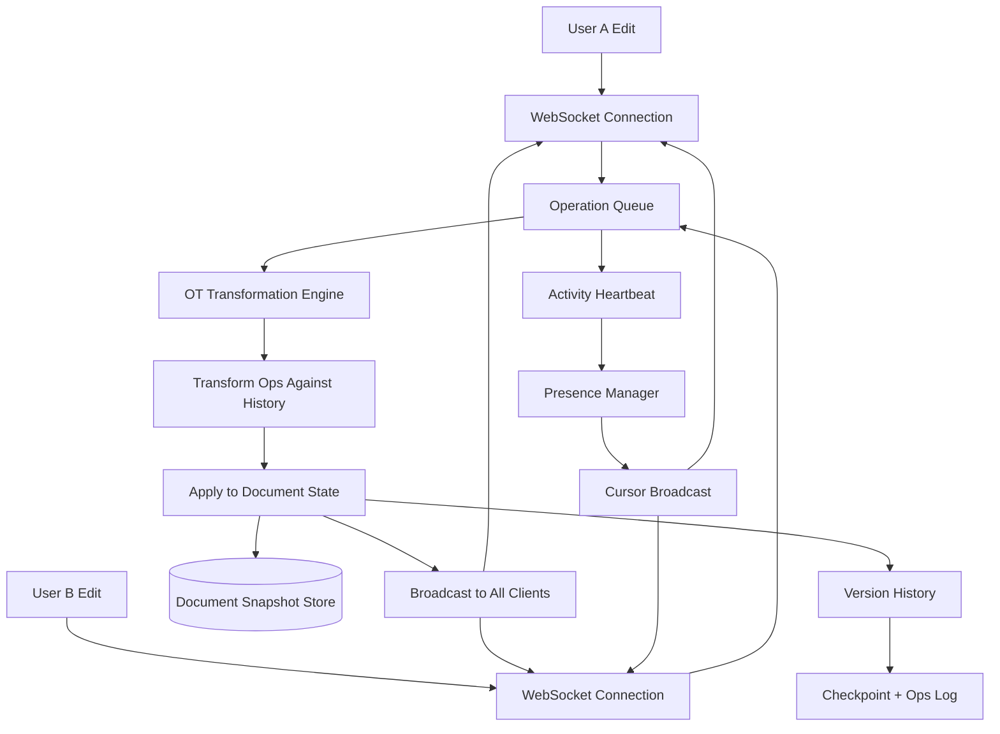
```mermaid
graph TD
    A[User A Edit] --> B[WebSocket Connection]
    C[User B Edit] --> D[WebSocket Connection]
    B --> E[Operation Queue]
    D --> E
    E --> F[OT Transformation Engine]
    F --> G[Transform Ops Against History]
    G --> H[Apply to Document State]
    H --> I[(Document Snapshot Store)]
    H --> J[Broadcast to All Clients]
    J --> B
    J --> D
    E --> K[Activity Heartbeat]
    K --> L[Presence Manager]
    L --> M[Cursor Broadcast]
    M --> B
    M --> D
    H --> N[Version History]
    N --> O[Checkpoint + Ops Log]
```

---

## 20. Design a WhatsApp‑style Read Receipt & Delivery Status System

**Asaan Urdu mein:**  
Message states (sent → delivered → read) per recipient ke liye state machine me store hoti hain. Recipient ke WebSocket connection se delivery aur read acknowledgments bheje jate hain. Jab user chat kholta hai to batch read receipt generate hoti hai, write load kam hota hai. Fast writes ke liye Redis, persistence ke liye Cassandra. Users privacy setting se read receipt disable kar sakte hain, us case me read status update skip hoti hai.

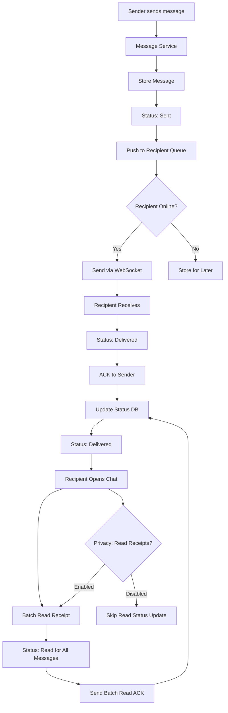
```mermaid
graph TD
    A[Sender sends message] --> B[Message Service]
    B --> C[Store Message]
    C --> D[Status: Sent]
    D --> E[Push to Recipient Queue]
    E --> F{Recipient Online?}
    F -->|Yes| G[Send via WebSocket]
    F -->|No| H[Store for Later]
    G --> I[Recipient Receives]
    I --> J[Status: Delivered]
    J --> K[ACK to Sender]
    K --> L[Update Status DB]
    L --> M[Status: Delivered]
    M --> N[Recipient Opens Chat]
    N --> O[Batch Read Receipt]
    O --> P[Status: Read for All Messages]
    P --> Q[Send Batch Read ACK]
    Q --> L
    N --> R{Privacy: Read Receipts?}
    R -->|Disabled| S[Skip Read Status Update]
    R -->|Enabled| O
```

---

<!--LANG:english-->

# System Design Case Scenarios  

---

## 1. Design a **URL Shortening Service** (like Bitly)  

---  

💡 **Tips for a robust design**  

- Identify core entities: **URL**, **User**, **Click analytics**.  
- Choose a key‑generation strategy: **hash‑based**, **sequential IDs**, or **base‑62 encoding**.  
- Plan for **collision handling** and **custom aliases**.  
- Use **read‑through cache** (e.g., Redis) for fast redirects.  
- Store mappings in a **sharded relational/NoSQL store** for scalability.  
- Implement **TTL/expiration** for temporary links.  
- Add an **analytics pipeline** (stream processing) for click tracking.  

---

## 2. Design a **Rate Limiter** for a Public API  

---  

💡 **Key considerations**  

- Decide on the limiting algorithm: **Fixed Window**, **Sliding Window**, or **Token Bucket**.  
- Store counters in a **distributed cache** (Redis, Memcached) with **TTL**.  
- Ensure **atomic increments** (Lua scripts or Redis INCR).  
- Provide **client‑side headers** (`X-RateLimit-Limit`, `X-RateLimit-Remaining`).  
- Handle **burst traffic** with a **leaky‑bucket** or **token‑bucket** approach.  
- Plan for **global vs per‑client limits** and **IP‑based throttling**.  

---

## 3. Design a **Chat Application** (like WhatsApp or Slack)  

---  

💡 **Design pillars**  

- Use **WebSocket** or **gRPC streaming** for real‑time bidirectional communication.  
- Persist messages in a **distributed log** (Kafka) and a **NoSQL store** for history.  
- Implement **presence** and **typing indicators** via lightweight pub/sub.  
- Ensure **message ordering** with sequence numbers or vector clocks.  
- Provide **offline sync** with push notifications (FCM/APNs).  
- Secure chats with **end‑to‑end encryption** and **access control lists**.  

---

## 4. Design a **News Feed System** (like Facebook or Twitter/X)  

---  

💡 **Core components**  

- **Write path**: ingest posts, fan‑out to followers using **message queues** (Kafka).  
- **Read path**: serve personalized timelines from a **cache** (Redis) or **materialized view**.  
- Choose between **push‑based fan‑out** vs **pull‑based on‑demand**; hybrid often works best.  
- Apply **ranking algorithms** (score = recency + engagement + social graph).  
- Store raw events in **immutable storage** (S3) for replayability.  
- Use **CDN** for static assets (images, videos).  

---

## 5. Design a **Notification System** (email, SMS, push)  

---  

💡 **Design checklist**  

- Decouple producers and consumers with a **message broker** (Kafka, RabbitMQ).  
- Implement **template rendering** and **personalization** service.  
- Use **channel adapters** for email (SMTP), SMS (Twilio), push (FCM/APNs).  
- Provide **retry & dead‑letter queues** for failed deliveries.  
- Track **delivery status** and **user preferences** (opt‑out).  
- Scale outbound workers horizontally; rate‑limit per provider.  

---

## 6. Design an **E‑commerce Checkout & Inventory System**  

---  

💡 **Critical aspects**  

- **Atomic checkout** using **distributed transactions** or **saga pattern**.  
- Real‑time **inventory reservation** with a fast store (Redis) and fallback to DB.  
- **Payment gateway integration** (tokenization, webhook handling).  
- **Order state machine** (Created → Paid → Shipped → Completed/Cancelled).  
- **Idempotency keys** to avoid duplicate orders.  
- **Event sourcing** for audit trail and eventual consistency across services.  

---

## 7. Design a **File Storage and Sharing Service** (like Google Drive/Dropbox)  

---  

💡 **Key design elements**  

- Store blobs in **object storage** (S3, GCS) with **metadata** in a relational/NoSQL DB.  
- Use **content‑addressable storage** (hash of file) for deduplication.  
- Implement **upload/download APIs** with **multipart upload** for large files.  
- Manage **access control lists (ACLs)** and **share links** with signed URLs.  
- Provide **versioning** and **conflict resolution**.  
- Use **CDN** for fast content delivery.  

---

## 8. Design a **Ride‑Sharing System** (like Uber/Careem)  

---  

💡 **Major components**  

- **Geospatial indexing** (QuadTree, GeoHash) for driver‑rider matching.  
- Real‑time **location streaming** via WebSocket or MQTT.  
- **Dispatch algorithm** (nearest driver, surge pricing).  
- **Trip lifecycle** service (request → match → pickup → drop‑off).  
- **Pricing engine** with dynamic pricing rules.  
- **Payments** and **rating** subsystems.  

---

## 9. Design a **Video Streaming Service** (like YouTube/Netflix)  

---  

💡 **Design considerations**  

- Store original videos in **object storage**; generate **multiple renditions** (different resolutions, codecs).  
- Use **CDN** for edge delivery; support **adaptive bitrate streaming** (HLS/DASH).  
- Maintain **metadata catalog** (titles, tags, recommendations).  
- Implement **transcoding pipeline** (media workers, job queue).  
- Provide **user authentication**, **watch history**, and **personalized recommendations**.  
- Ensure **DRM** and **content protection** where needed.  

---

## 10. Design a **Web Crawler / Search Engine Indexer**  

---  

💡 **Core pipeline**  

- **Crawler**: distributed workers with politeness policies (robots.txt, rate limiting).  
- **URL frontier** stored in a **priority queue** (e.g., Kafka).  
- **Parser** extracts text, links, metadata.  
- **Indexer** builds inverted index; store in **search‑optimized store** (Elasticsearch, Solr).  
- **Deduplication** using URL hashes or content fingerprints.  
- **Ranking** module for query serving.  

---

## 11. Design a **Distributed Cache** (like Redis at scale)  

---  

💡 **Scalability tactics**  

- **Sharding** (consistent hashing) to distribute keys across nodes.  
- **Replication** for high availability (master‑replica).  
- **Eviction policies** (LRU, LFU, TTL).  
- **Cluster management** with gossip protocol for node discovery.  
- **Failover** handling via sentinel or built‑in cluster mechanisms.  
- **Write‑through / write‑behind** strategies for persistence.  

---

## 12. Design a **Payment Processing System**  

---  

💡 **Essential flows**  

- **Tokenization** of card data; store only tokens.  
- **Authorization** → **Capture** → **Settlement** workflow with external acquirers.  
- **Webhook handling** for async events (refunds, disputes).  
- **Idempotent APIs** to prevent duplicate charges.  
- **PCI‑DSS compliance** and **fraud detection** (risk scoring).  
- **Reconciliation** and **audit logs** for financial integrity.  

---

## 13. Design a **Job Scheduler / Task Queue System**  

---  

💡 **Design pillars**  

- **Producer** enqueues jobs in a durable queue (Kafka, RabbitMQ, SQS).  
- **Worker pool** pulls tasks; supports **auto‑scaling** based on queue depth.  
- **Retry policy** with exponential back‑off and dead‑letter queue.  
- **Task deduplication** (unique job IDs).  
- **Scheduling** (cron‑like) via time‑wheel or priority queue.  
- **Visibility timeout** to handle worker crashes.  

---

## 14. Design an **Autocomplete / Typeahead Search Feature**  

---  

💡 **Implementation hints**  

- Store **prefix trees (Trie)** or **n‑gram indexes** in memory for low latency.  
- Pre‑compute **popularity scores** to rank suggestions.  
- Use **fallback to search service** (Elasticsearch) for rare prefixes.  
- Cache recent queries per user for personalization.  
- Apply **debounce** on client side to reduce request volume.  

---

## 15. Design a **Booking System** (like hotel or movie ticket booking)  

---  

💡 **Key challenges**  

- **Inventory reservation** with atomic lock (Redis SETNX) to avoid overbooking.  
- **Seat selection** using a **bitmap** or **graph representation**.  
- **Payment flow** integrated with reservation (hold → capture).  
- **Cancellation & refund** policies.  
- **Notification** (email/SMS) for confirmations.  
- **Scalable read path** for availability queries (cache hot data).  

---

## 16. Design a **Distributed Logging/Monitoring System**  

---  

💡 **Typical stack**  

- **Log collectors** (Fluentd, Logstash) ship logs to a **central store** (Kafka, S3).  
- **Indexing** in Elasticsearch for searchability.  
- **Metrics** via Prometheus; alerts via Alertmanager.  
- **Visualization** dashboards (Grafana, Kibana).  
- **Retention policies** and **partitioning** for cost control.  
- **Security**: log encryption at rest and in transit.  

---

## 17. Design an **Online Voting/Polling System**  

---  

💡 **Design focus**  

- **One‑vote‑per‑user** enforcement using **unique tokens** or **IP + cookie** checks.  
- Store votes in an **append‑only log** for immutability.  
- Use **eventual consistency** for real‑time result updates (Redis counters).  
- Protect against **ballot stuffing** with CAPTCHAs and rate limiting.  
- Provide **audit trail** for verification.  

---

## 18. Design a **Multi‑Tenant SaaS Application Architecture**  

---  

💡 **Tenancy models**  

- **Separate databases** per tenant for strong isolation.  
- **Shared database + tenant_id column** for cost efficiency.  
- **Hybrid**: shared core services, isolated data stores for high‑value tenants.  
- Implement **tenant‑aware authentication/authorization** (JWT with tenant claim).  
- **Schema migrations** must be tenant‑aware.  
- **Monitoring & billing** per tenant using usage metrics.  

---

## 19. Design a **Real‑Time Collaborative Document Editor** (like Google Docs)  

---  

💡 **Collaboration techniques**  

- **Operational Transformation (OT)** or **Conflict‑free Replicated Data Types (CRDTs)** for concurrency.  
- **WebSocket** for low‑latency edit propagation.  
- Store document state in **distributed storage** (e.g., Cloud Firestore) with versioning.  
- **Presence** and **cursor tracking** via lightweight pub/sub.  
- **Access control** per document (owner, editors, viewers).  
- Periodic **snapshotting** to reduce replay cost.  

---

## 20. Design a **WhatsApp‑style Read Receipt & Delivery Status System**  

---  

💡 **Key mechanisms**  

- **Message state machine**: Sent → Delivered → Read.  
- Use **acknowledgment messages** over persistent connections (WebSocket, MQTT).  
- Store per‑message status in a **fast key‑value store** (Redis) for real‑time queries.  
- **Push notifications** for offline delivery, updating status when device comes online.  
- Ensure **privacy**: only intended recipients see read receipts.  
- Scale with **sharded status tables** and **eventual consistency** across devices.  

---

## 💻 Coding Challenges  

*No coding‑implementation questions were provided in the original list.*
